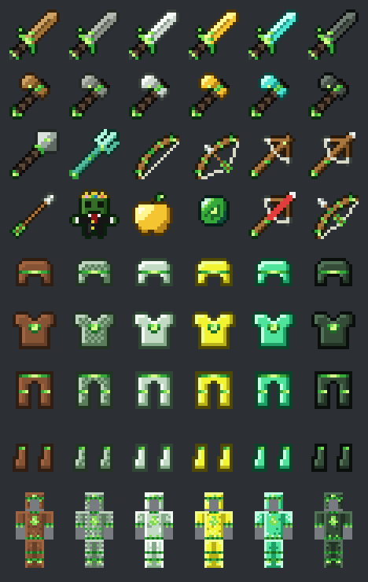
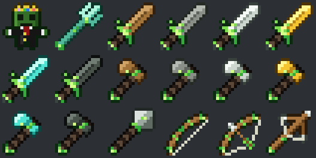

# Green PvP resource pack

One resource pack that turns the whole game green: drop `GreenPvP.zip` into
`.minecraft/resourcepacks/` and turn it on. No mods, OptiFine, Iris or setup needed.

- **The whole world is green** (on 1.21 and 1.21.1): every block, item, mob, particle,
  the sky, clouds and beacon beams. See [Green World](#green-world).
- **Hand-made, animated green textures** for weapons, armor, elytra, the totem (drawn from
  the player skin), end crystals and obsidian. Swords follow the reference design: a blade
  in the material's own color with a dark fuller, a dark wrapped handle, and a green vine
  crossguard and pommel set with an emerald.
- **Everything stays tellable apart:** materials keep their brightness and relative
  colors, and potions keep their effect colors.

It pairs with [Green Shaders](../green-shaders/), but doesn't need it.

## What's included

| Group | Items |
| --- | --- |
| Swords and axes | wooden, stone, iron, golden, diamond, netherite |
| Other weapons | mace, trident (inventory icon), bow (+3 pull stages), crossbow (standby, 3 pull stages, loaded arrow, loaded firework), arrow, shield |
| Totem | totem of undying drawn from the player skin: crown with gems, green face, black suit, red tie, green hands |
| Consumables | golden apple (the enchanted one uses the same texture), ender pearl |
| Elytra | item icon, broken elytra (torn and faded, so you notice), and the wings when flying |
| End crystal (special) | animated item icon and the placed crystal: green glass frame, glowing emerald core, obsidian-green base |
| Obsidian (special) | animated green-black crystal with glowing veins; crying obsidian with green tears running down |
| Armor icons | leather (dyeable, green parts stay green), chainmail, iron, golden, diamond, netherite |
| Worn armor | all six materials, for both 1.21.1 and 1.21.2+ texture paths |

## Animations

All animations use the game's built-in animated textures (`.png.mcmeta`), so they work
without mods or OptiFine.

- **Swords, axes, mace, bow and crossbow:** a green glint sweeps from the handle to the
  tip, then the emeralds and vines pulse until the next sweep (2.4 second loop). The
  glint only covers a narrow band, so the material color shows most of the time.
- **Trident (special):** a bolt of green energy climbs the shaft, the prongs flash,
  sparks crackle around the tips, and then it settles into a soft glow (3.2 second loop).
- **Armor and elytra icons:** the same green glint as the weapons. Leather armor animates
  its green overlay, so dyes still work.
- **Totem:** its outline breathes green, and the four crown gems twinkle in turn. The
  animation also plays in the totem pop when it saves you.
- **End crystal:** the emerald core throbs and a glint circles the glass frame.
- **Obsidian:** pulses of green light travel along its veins. **Crying obsidian:** green
  tears run down it.

Animated textures show in the inventory, in your hand, on dropped items and (for obsidian)
on placed blocks. Worn armor, the elytra wings, the placed end crystal and the 3D trident
use entity textures, which the game can't animate, so those are drawn green but stay still.
The placed end crystal already spins and bobs on its own.

## Green World

The pack replaces one of Minecraft's built-in shader files, `shaders/include/fog.glsl`.
Every world shader in 1.21 and 1.21.1 runs its `linear_fog` function last, so grading
the color there turns everything green. The source is in
[`world_shader/fog.glsl`](world_shader/fog.glsl).

- Colors are squeezed toward green, not painted over, and brightness never changes. Red
  becomes yellow-green, blue becomes teal, grays get a green tint, and white stays white,
  so a diamond ore still looks different from an emerald ore. Purples, which sit
  opposite green, turn a soft gray-green.
- It also tints chat and name-tag text slightly; team colors stay distinct from each other.
- The strength is `GW_LEAN` in `fog.glsl` (0.4 by default).
- It only loads on Minecraft 1.21 and 1.21.1 (it's in a pack overlay for format 34). On
  other versions the pack still loads with all the hand-made textures; use `greenify`
  below for the rest.
- With an OptiFine or Iris shader pack active, the game ignores resource-pack shaders, and
  the shader pack (like Green Shaders) does the coloring instead.

## Green Everything (optional, for other versions)

You don't need this on 1.21.1; GreenPvP.zip already turns everything green there.
`greenify.py` bakes the same effect into the textures themselves, for versions the
shader doesn't support. Mojang's textures can't be shared, so it runs on your computer
and reads them from your own copy of the game.

1. Unzip `dist/GreenEverything-builder.zip` anywhere (it holds `greenify.py`, the
   launchers and the hand-made textures).
2. Launch your Minecraft version once with the official launcher, so the game files exist.
3. Install [Python 3](https://www.python.org/downloads/). On Windows, tick
   **Add Python to PATH**.
4. Run it from the unzipped folder:
   - **Windows:** double-click `greenify.bat`
   - **macOS/Linux:** `./greenify.sh`
   - Pick the version: `greenify.bat --version 1.21.4` (or `./greenify.sh --version 1.21.4`)
5. Put the `dist/GreenEverything.zip` it creates (inside the unzipped folder) into
   `.minecraft/resourcepacks/`, and use it **instead of** GreenPvP.zip.

How it keeps things tellable apart: colors are squeezed toward green, not painted over.
Red becomes yellow-green, blue becomes teal, grays get a green tint, and brightness never
changes, so a diamond ore still looks different from an emerald ore. It leaves alone:

- potions, tipped arrows, spawn eggs, banners and armor trim colors (their color is information)
- dyed leather, and grass, leaves, water and redstone dust (the game colors these itself)
- player skins and capes

How strongly each kind of texture turns green is set in `LEAN` at the top of `greenify.py`.

## Telling gear apart

- **Weapons** keep each material's hue on the blade or head: wood is brown, stone gray,
  iron near-white, gold yellow, diamond aqua and netherite near-black. Green only appears
  on the guard, pommel, bindings and vines.
- **Armor** is pulled toward green (`ARMOR_GREEN_LEAN` in `generate.py`) without changing
  its lightness. Iron stays the lightest and netherite the darkest; gold still reads as
  yellow, diamond as aqua, and chainmail keeps its mesh pattern.
- **Leather armor** is still dyeable. The vines live in the overlay texture, so they
  stay green whatever dye you use.
- **Potions and tipped arrows are untouched**, because their colors tell you the effect.
- With the shader, turn on **Protect PvP Colors** (on by default) so the green grade
  doesn't wash out these colors.

## Install

1. Put `dist/GreenPvP.zip` in `.minecraft/resourcepacks/`. Don't unzip it.
2. Enable it under **Options → Resource Packs**.

To rebuild it after changing `generate.py`, run `./build.sh` (needs Python 3 and Pillow).

The pack targets Minecraft 1.21.1 (pack format 34) and declares support up to format 64.
On newer versions the game marks it "made for an older version", but it still loads
when you confirm.

## Customizing

Every texture is drawn in code in `generate.py`; no Mojang textures are copied.
Change palettes (`TOOL`, `ARMOR`, `GREEN`), the armor green lean, or shapes, then run
`./build.sh`. `preview.py` renders `preview.png`, which shows every icon plus a front view
of each worn armor set.

## Not covered

- Worn armor, elytra wings, the placed end crystal and the 3D trident are green but
  don't animate (the game can't animate textures drawn on bodies).
- On versions other than 1.21/1.21.1, only the hand-made textures are green; use
  `greenify` for the rest.
