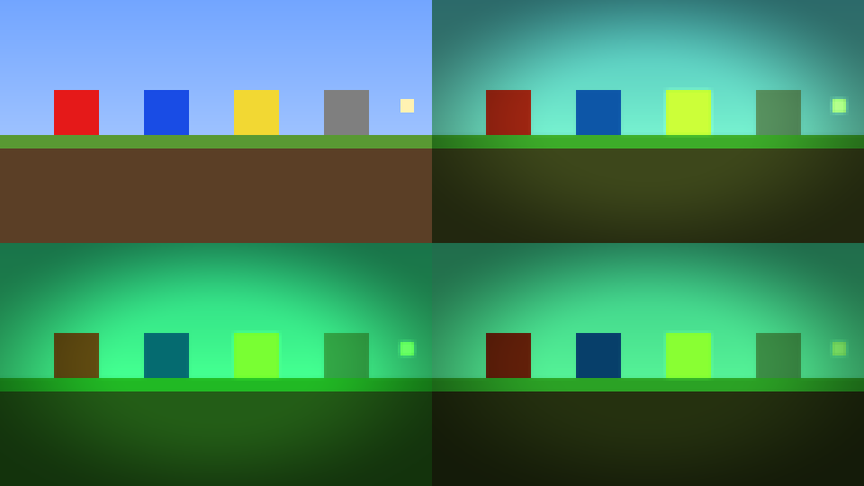

# Green Shaders

A lightweight shader pack for OptiFine and Iris that gives Minecraft a green color grade.
It is one full-screen pass, so it runs well even on weak GPUs.

*Clockwise from top left: original, Emerald, Terminal, Night Vision (default settings).*

## Install

1. Build the zip with `./build.sh` (or zip the `shaders/` folder yourself, keeping the
   `shaders` folder at the root of the zip).
2. Copy `dist/GreenShaders.zip` into `.minecraft/shaderpacks/`.
3. In game: **Options → Video Settings → Shader Packs** and select **GreenShaders**.

## Options

Everything can be changed in game under **Shader Options**:

| Option | What it does |
| --- | --- |
| Style | **Emerald** keeps some original color, **Night Vision** is monochrome green, **Terminal** is hard phosphor green |
| Green Strength | 0 = original colors, 1 = full effect |
| Color → Saturation / Brightness / Contrast / Gamma | Final color adjustments |
| Effects → Vignette | Darkens the screen edges |
| Effects → Glow | Soft bloom around torches, lava and the sky |
| Effects → Scanlines | CRT-style lines (off by default) |
| Effects → Film Grain | Animated noise (off by default) |

## Files

- `shaders/final.vsh`, `shaders/final.fsh`: the full-screen pass (GLSL 1.20, works on both loaders)
- `shaders/shaders.properties`: options menu layout and sliders
- `shaders/lang/en_us.lang`: option names and tooltips
