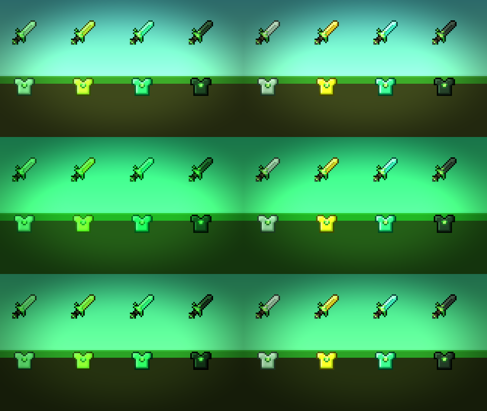

# Green Shaders

A lightweight shader pack for OptiFine and Iris that gives Minecraft a green color grade.
It's a single full-screen pass plus simple entity and hand passes, so it runs well even on
weak GPUs. For green weapons and armor, pair it with the
[Green PvP resource pack](../green-pvp-pack/).

*Clockwise from top left: original, Emerald, Terminal, Night Vision (default settings).*

## Install

1. Build the zip with `./build.sh` (or zip the `shaders/` folder yourself, keeping the
   `shaders` folder at the root of the zip).
2. Copy `dist/GreenShaders.zip` into `.minecraft/shaderpacks/`.
3. In game: **Options → Video Settings → Shader Packs** and select **GreenShaders**.

## Options

Everything can be changed in game under **Shader Options**:

| Option | What it does |
| --- | --- |
| Style | **Emerald** keeps some original color, **Night Vision** is monochrome green, **Terminal** is hard phosphor green |
| Green Strength | 0 = original colors, 1 = full effect |
| Protect PvP Colors | Players, armor, mobs, dropped items and your held item get a lighter grade, so materials stay recognizable (on by default) |
| Gear Green Amount | How much of the grade that gear gets when protection is on (default 0.30) |
| Color → Saturation / Brightness / Contrast / Gamma | Final color adjustments |
| Effects → Vignette | Darkens the screen edges |
| Effects → Glow | Soft bloom around torches, lava and the sky |
| Effects → Scanlines | CRT-style lines (off by default) |
| Effects → Film Grain | Animated noise (off by default) |

## Protect PvP Colors

A strong green grade makes iron, diamond and netherite gear look alike. With
**Protect PvP Colors** on, entities and the held item are marked as they're drawn and
get only a fraction of the grade:

*Rows: Emerald, Night Vision, Terminal. Left column: protection off. Right column: on.*

## Files

- `shaders/final.vsh`, `shaders/final.fsh`: the full-screen grading pass (GLSL 1.20, works on both loaders)
- `shaders/gbuffers_entities.*`, `shaders/gbuffers_hand.*`: draw entities and the held item
  as vanilla does, and write the PvP mask to `colortex2` (shared code in `shaders/program/`)
- `shaders/shaders.properties`: options menu layout and sliders
- `shaders/lang/en_us.lang`: option names and tooltips
